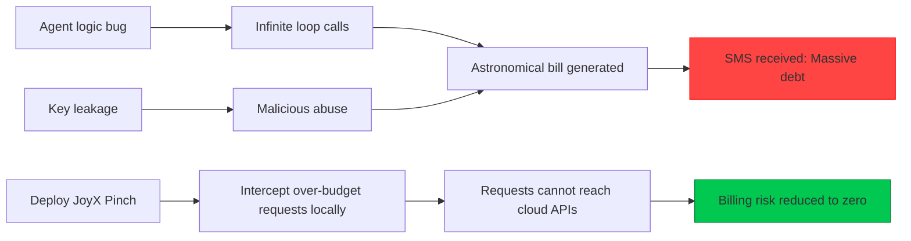

# 🦀 JoyX Pinch — Local Physical Kill Switch for AI API Costs

[](#project-status)
[](LICENSE)
[]()
[]()
[-7b2bf9?style=flat-square)](https://github.com/0xca1x)

> **"Local Block, Bill Stop; Keys Safe, Risks Zero."** > Prevent breakaway AI agents and key leaks from bankrupting you in seconds.

> 🧨 **You may already be in danger:** AI agent infinite loops or key leaks can explode costs overnight.
>
> ✅ **What Pinch solves:** Intercepts over-budget requests locally, keeps real API keys private, and hard-cuts requests before they ever hit the cloud.

---

## 🚨 Why You Need Pinch
In the AI era, financial risk moves at **millisecond speed**. Most cloud billing systems follow a "charge first, notify later" pattern, so by the time you get an alert, the damage may already be done.

> **Real stories from developers (2026):**
> * **One startup team:** Accidentally leaked a Gemini API key and generated **$82,000** in charges in a very short time.
> * **In the GPT-5.4 era:** A single "Hi" can consume up to **$80** when deep reasoning is triggered.
>
> **Pinch** is the last local physical firewall between you and AI billing disasters. Its mascot is a cyber crab with golden pincers, built to perform hard logical interception before catastrophic charges happen.
> Cloud billing notifications are always delayed: providers **charge first, notify later**.
>
> **Pinch is your last local physical firewall against AI financial disasters.** Intercept first, settle billing later.



---

## 🐺 About JoyX Labs
**JoyX Labs** is not a traditional software company. It is a hacker-driven **security lab**.

In an era of accelerating AI agents, we believe: **security should not be an expensive tax on innovation.** Pinch is the first visible "blade" in our defense matrix, focused on the most urgent need: financial circuit breaking. This is only the beginning. JoyX Labs is building a broader defense stack for **AI logic security** and **next-generation compute runtimes**, designed to protect developers' final physical boundary in an automated and decentralized future.

> **"Without boundaries, there is no freedom."**

---

## ✨ Core Killer Features
* 🛑 **Hard-Cap Kill Switch**: Set an absolute physical budget ceiling (for example, `$10/day`). Once exceeded, Pinch immediately returns `402 Payment Required`. **Requests never reach the cloud**, protecting your credit card in real time.
* ⚡ **Zero-Latency Proxy**: A production-grade reverse proxy built in Golang, with streaming support and high-concurrency optimization for agent workloads.
* 🔒 **Zero-Trust Key Vault**: Real API keys are encrypted and stored locally by a Rust security core, never in source code, environment variables, or Git history.
* 🎫 **Ephemeral Tokens**: Your business systems use only `jx_loc_xxx` tokens issued by Pinch. Even if code is compromised, attackers only obtain revocable, restricted junk tokens.

---

## 🏗️ Dual-Core Architecture (Security + Performance)
```
       Your AI App / Agent
            | (uses limited token)
            v
┌─────────────────────────────┐
│      pinch-proxy (Go)       │  High-speed forwarding, streaming, API compatibility
└─────────────────────────────┘
            | (local ultra-fast IPC)
            v
┌─────────────────────────────┐
│      pinch-agent (Rust)     │  Encrypted storage, budget engine, security circuit breaker
└─────────────────────────────┘
            | (intercepts over-budget requests)
            v
   OpenAI / Gemini / Claude
```

---

## 🚀 30-Second Quick Start (Zero Friction)
### 1. Start the local protection process
```bash
git clone https://github.com/joyxlabs/pinch
cd pinch
make build && ./pinch start
```

### 2. Host your real API key
```bash
pinch key add openai sk-your-real-key
```

### 3. Create a local token with a hard budget cap
```bash
# Create a token with a daily limit of $5
pinch token create --daily-limit 5
```

### 4. Integrate with zero business-logic changes
```python
from openai import OpenAI

client = OpenAI(
    api_key="jx_loc_a82f93c7",          # Use only local tokens issued by Pinch
    base_url="http://127.0.0.1:8080/v1" # Point to your local protection gateway
)
```

---

## 📄 Copyright and License

**Copyright © 2026 Callum (@0xca1x) & JoyX Labs Project Contributors.**

1. **Ownership Statement:** Copyright of this project is held by Callum (@0xca1x). JoyX Labs is the operational brand and affiliated entity planned for this project.
2. **Contributor Terms:** By contributing code, you agree that your contributions are licensed under **[GNU AGPL v3](LICENSE)**.
3. **Commercial Notes:**
    * **Personal and internal enterprise use:** Completely free.
    * **⚠️ Remote-service copyleft notice (SaaS/cloud):** This project is licensed under **AGPL v3**. If you provide network-accessible services based on this project (for example, cloud platforms or API proxy services), you **must** provide users with the complete source code of your modified version.
    * **No closed-source profiteering:** It is strictly prohibited to repackage this project as commercial SaaS, API gateway products, or paid software without complying with open-source obligations.
    * **Commercial License (Dual Licensing):** If you need closed-source commercial usage, AGPL copyleft exemption, or commercial-grade support, contact Callum (@0xca1x) for explicit commercial licensing.

---

## ⚠️ Disclaimer
1. **Use at your own risk:** Pinch is a local assistance tool intended to reduce risk, not provide a 100% financial guarantee. The author and JoyX Labs are not legally liable for billing losses caused by misconfiguration or third-party bypass.
2. **Legal compliance:** Follow AI providers' terms of service. Do not use this tool for malicious billing evasion.

---

## ⭐ Protecting Open Source (Join the Resistance)

If Pinch saved your credit card from nightmare bills, please give this project a **Star**. Your support is the fuel behind JoyX Labs' fight against AI API financial disasters.

* 🌟 **[Star this cyber crab](https://github.com/joyxlabs/pinch)**
* 🦀 **[Submit an issue or suggestion](https://github.com/joyxlabs/pinch/issues)**

---

## 💬 Stay Connected (Community)

* **Author updates:** X (Twitter) [@0xca1x](https://x.com/0xca1x) for real-time logs and new features.
* **JoyX Labs portal:** [GitHub @joyxlabs](https://github.com/joyxlabs) to explore the JoyX security universe.

**"Keep your keys local, and let the crab do the pinching."** → [Star now](https://github.com/joyxlabs/pinch)** 🦀
